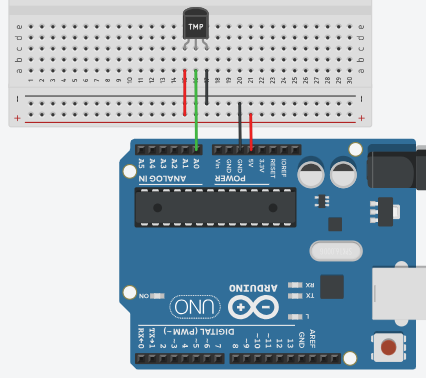
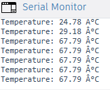

# Arduino TMP36 Serial Temperature Monitor

## Overview
This project demonstrates how to use a **TMP36 Temperature Sensor** with an **Arduino Uno** to measure temperature and display the readings in the **Serial Monitor**.



The TMP36 is a simple analog temperature sensor that outputs a voltage proportional to the temperature, making it a great beginner-friendly component for learning sensor input and serial communication.



This project helps in understanding:
- Analog sensor reading
- Voltage-to-temperature conversion
- Serial Monitor output
- Basic temperature sensing

---

## Components
- Arduino Uno
- TMP36 Temperature Sensor
- Breadboard
- Jumper Wires
- USB Cable

---

## Wiring

### TMP36 Pin Connections
With the **flat side of the TMP36 facing you**, the pins are:

- **Left pin (+Vs)** → Arduino **5V**
- **Middle pin (Vout)** → Arduino **A0**
- **Right pin (GND)** → Arduino **GND**

> Note: The TMP36 does **not require a resistor** for this basic setup.

---

## How It Works
- The TMP36 senses the surrounding temperature
- It outputs an analog voltage based on the temperature
- Arduino reads that voltage using **A0**
- The voltage is converted into temperature in Celsius
- The result is printed to the **Serial Monitor**

---

## Code
```cpp
const int sensorPin = A0;

void setup() {
  Serial.begin(9600);
}

void loop() {
  int reading = analogRead(sensorPin);

  // Convert analog reading to voltage
  float voltage = reading * (5.0 / 1023.0);

  // TMP36 formula
  float temperatureC = (voltage - 0.5) * 100;

  Serial.print("Temperature: ");
  Serial.print(temperatureC);
  Serial.println(" °C");

  delay(1000);
}
